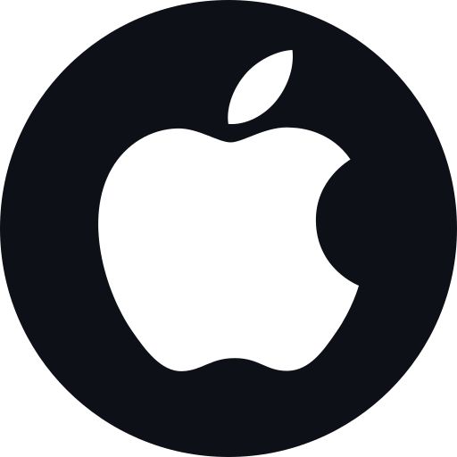

# Hi there, I'm Mateusz 👋
### I'm a React Native developer, currently working for [Qudini](https://www.qudini.com/)

 
 

  &emsp;
  &emsp;
  &emsp;
  &emsp;
  &emsp;
  

 

  &emsp;
  &emsp;
  

 

  &emsp;
  &emsp;
  &emsp;
  &emsp;
  &emsp;
  &emsp;
  &emsp;
  &emsp;
  

 

### Contact me:
